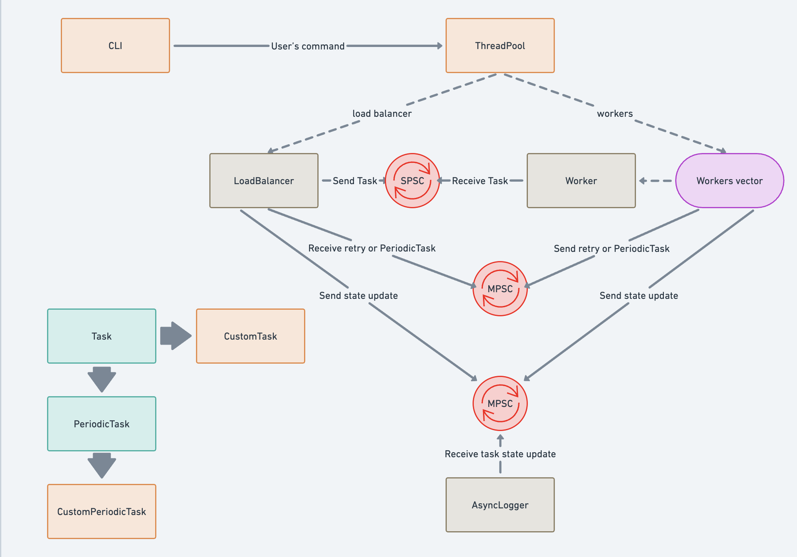

# Job-Scheduler

A C++ job scheduler library.

## Description

This library was created as a CS studies project for advanced C++ programming course. It provides a robust, efficient framework for scheduling and executing tasks within a multithreaded environment. Key features include support for user-defined task types, priority-based scheduling, and real-time job state monitoring. Additionally, the library incorporates a configurable retry mechanism, time-based execution (deferred scheduling), and comprehensive resource management.

## Architecture 

### Tasks

The system employs an inheritance-based model for task definition. By extending the base `Task` class, users can implement custom execution logic, resource constraints, and priority levels. For workloads requiring recurring execution, the `PeriodicTask` subclass provides a specialized interface for defining fixed-interval intervals and persistence logic.

### Thread pool

The `Thread Pool` serves as the system's execution engine. It manages a configurable set of worker threads designed to process tasks concurrently. To ensure optimal resource utilization, the pool integrates a Load Balancer that distributes workloads according to a defined strategy (e.g. Priority-aware Round-Robin).

### Scheduling Logic & Load Balancing

Task distribution is managed through a dual-queue architecture to decouple immediate execution from time-deferred jobs:
- Ready Queue: A priority-aware queue containing tasks immediately eligible for execution.
- Scheduled Queue: A time-sorted buffer for tasks waiting for a specific execution time.

The Load Balancer continuously monitors these queues, promoting tasks from the Scheduled Queue to the Ready Queue as their execution time arrives, and subsequently dispatching them to available worker threads following certain scheduling policies.

### Retry mechanism and periodic tasks

Reliability is managed via a Feedback Channel that enables communication between worker threads and the Load Balancer:

- Retry Mechanism: Upon task failure, the worker thread transmits a failure signal. The Load Balancer evaluates the task against the defined retry policy to determine if it should be re-queued or finalized as failed.

- Periodic Scheduling: For PeriodicTask instances, the worker thread notifies the Load Balancer upon successful completion. The Load Balancer then calculates the next execution time and re-inserts the task into the Scheduled Queue.

### Job state monitoring

Job state monitoring allows users to track the status of their tasks in real-time. It is implemented using async logger that logs task state changes (e.g., Pending, Running, Succeeded, Failed, Stopped) to a file or console.

### Communication between components

The communication between components (e.g. worker threads, load balancer, job state monitor) is facilitated through SPSC, MPSC channels (depending on situation) that allow for efficient and thread-safe message passing. This design ensures that the system can handle high concurrency and maintain responsiveness even under heavy load.

**Possible extensions**
- Lock free SPSC
- Lock free MPSC

### CLI 

A Command-Line Interface is provided for administrative interaction. The CLI allows for real-time task injection, status interrogation, and lifecycle management of the scheduler service.



## Prerequisites

- CMake 4.0+
- C++20 compiler (GCC 10+ or Clang 12+)
- Make

## Building

**Quick start (recommended):**

```bash
make build     # configure + build (Debug, ASan enabled)
make test      # run tests
make release   # build optimized (Release, no ASan)
make examples  # build examples (Debug, ASan enabled)
make clean     # remove build directory
```

## Running Example

```bash
make examples
./build/example
```
