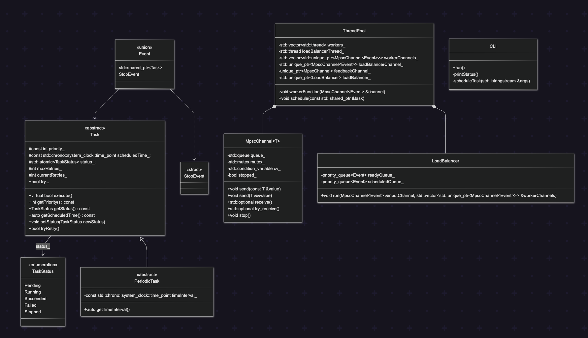

# Job-Scheduler

Biblioteka do planowania zadań w C++.

## Opis

Biblioteka stworzona w ramach projektu na studia informatyczne, kurs zaawansowanej programowania w C++. Zapewnia wydajny system do planowania i wykonywania zadań w środowisku wielowątkowym. Wspiera definiowanie własnych typów zadań, priorytetów oraz wgląd w stan zadań w czasie rzeczywistym. Co więcej biblioteka zapewnia mechanizm ponowienia wykonania zadania w razie błędu, planowanie zadań na określony czas oraz kompleksowe zarządzanie zasobami.

## Architektura systemu

### Zadania

Zadania są podstawowym elementem systemu. Każde zadanie reprezentowane jest poprzez obiekt dziecko klasy 'Task'. Zadania mogą być definiowane z różnymi priorytetami oraz zawierać swoją logikę wykonania. Zadania cykliczne reprezentowanę są jako dzieci klasy `PeriodicTask`, która rozszerza funkcjonalność podstawowej klasy `Task` o mechanizmy związane z planowaniem cyklicznym.

### Silnik 

Klasa `ThreadPool` stanowi główny element systemu. Zarządza zbiorem wątków roboczych, które są odpowiedzialne za współbieżne przetwarzanie zadań. Aby zapewnić opowiednie wykorzytsanie zasobów, `ThreadPool` posiada wbudowany `LoadBalancer`, który rozdziela zadania zgodnie z określoną strategią (np. priorytetowy Round-Robin).

### Planowanie i rozdzielanie zadań

Rozdzielanie zadań odbywa się za pomocą dwóch kolejek, które oddzielają zaplanowane zadania w czasie od tych, które są już gotowe:

- `Ready Queue`: Kolejka priorytetowa zawierająca zadania gotowe do natychmiastowego wykonania.
- `Scheduled Queue`: Kolejka priorytetowa posortowana według czasu, przechowująca zadania oczekujące na określony czas wykonania.

`LoadBalancer` ciągle monitoruje stan kolejek, przenosząc zadania z `Scheduled Queue` do `Ready Queue` gdy nadejdzie czas ich wykonania, a następnie rozdziela je między wątki roboczne zgodnie z określoną strategią.

### Mechanzim ponownego wykonania i zadania cykliczne

Dzięki dodatkowemu kanałowi komunikacji między wątkami roboczymi a `LoadBalancerem`, system jest w stanie obsługiwać mechanizmy ponownego wykonania zadań oraz zarządzać zadaniami cyklicznymi:

- Mechanizm ponownego wykonania: W przypadku błędu podczas wykonywania zadania, wątek roboczy wysyła informację o niepowodzeniu wraz z zadaniem do `LoadBalancer`, który decyduje czy zadanie powinno zostać ponowanie umieszczone w kolejce `Ready Queue` na podstawie maksymalnej liczby prób i innych kryteriów.

- Zadania cykliczne: Po pomyślnym wykonaniu zadania cyklicznego, wątek roboczy informuje `LoadBalancer`, który wylicza czas następnego wykonania i ponowanie umieszcza zadanie w `Scheduled Queue` zgodnie z ustalonym interwałem czasowym.

### Śledzenie stanu zadań

Dzięki atomiczności zmiennej przechowującej stan zadania, może być on bezpiecznie monitorowany i aktualizowany przez różne wątki. Użytkownik może sprawdzać aktualny stan zadania w dowolnym momencie (np. za pomocą interfejsu CLI). 

Stany zadań obejmują: `Pending`, `Running`, `Succeeded`, `Failed`, `Stopped`.

### Komunikacja między komponentami

Komunikacja między komponentami odbywa się za pomocą kanałów MPSC, które umożliwiają efektywny i bezpieczny wątkowo przesył informacji. Takie podejście zapewnia wydajność i responsywność systemu nawet przy dużym obciążeniu.

**Potencjalne rozszerzenia**
- Lock free SPSC dla komunikacji między `LoadBalancerem` a workerami, co może dodatkowo zwiększyć wydajność.

### Interfejs CLI 

Jako przykładowa forma interakcji z systemem, biblioteka zapewnia prosty interfejs CLI. Umożliwia on planowanie zadań, monitorowanie ich stanu oraz zarządzanie cyklem życia puli wątków.


## Diagram klas

### Task status 

Typ wyliczeniowy reprezentujący status zadania. Może przejmować wartości:
- `Pending` - zadanie oczekuje na wykonanie
- `Running` - zadanie jest aktualnie wykonywane
- `Succeeded` - zadanie zostało pomyślnie wykonane
- `Failed` - zadanie zakończyło się niepowodzeniem
- `Stopped` - zadanie zostało zatrzymane przed zakończeniem

### Task

Klasa abstrakcyjna reprezentująca zadanie do wykonania. Zawiera informację o statusie, priorytecie, czasie wykonania oraz ilości prób w razie niepowodzenia. Posiada wirtualną metodę `execute()`, która jest implementowana przez klasę dziedziczącą.

### PeriodicTask

Klasa dziedzicząca po `Task`, reprezentująca zadanie, które ma być wykonywane okresowo. Zawiera dodatkowe pole określające interwał czasowy między kolejnymi próbami wykonania zadania.

### ExecutionStatus

Typ wyliczeniowy reprezentujący wynik próby wykonania zadania:
- `Success` — zadanie zostało wykonane pomyślnie
- `Failure` — zadanie zakończyło się błędem
- `Reschedule` — zadanie powinno zostać ponownie zaplanowane

### TaskResult

Struktura przechowująca wynik wykonania zadania. Zawiera pole `status` typu `ExecutionStatus` oraz opcjonalne pole `message` z opisem wyniku.

### AsyncLogger

Klasa odpowiedzialna za asynchroniczne logowanie zdarzeń systemowych do pliku. Działa na osobnym wątku, do którego zdarzenia logowania przesyłane są przez kanał Mpsc. Udostępnia metody do zapisu zmiany stanu zadania oraz rezultatu.

### MpscChannel

Klasa generyczna reprezentująca kanał komunikacyjny typu MPSC (Multiple Producer Single Consumer). Umożliwia wielu producentom wysyłanie zdarzeń do jednego konsumenta. Zawiera metody do wysyłania, próby odbierania oraz odbierania zdarzeń. Wykorzystywana do bezpiecznej komunikacji między wątkami workerów, load balancerem, a wątkiem głównym.

### Event

Typy używane podczas komunikacji między wątkami:
- `TaskEvent` — zadanie przekazywane między wątkiem głównym, `LoadBalancerem`, a workerami
- `LogEvent` — struktura zawierająca nazwę zadania, treść wiadomości oraz znacznik czasu, używana przez workery do przesyłania wpisów do `AsyncLoggera`

### LoadBalancer

Klasa odpowiedzialna za zarządzanie rozdzielaniem zadań pomiędzy workerami. Odbiera zadania od wątku głównego i na podstawie priorytetu oraz czasu wykonania zadań, decyduje o kolejności ich wykonania. Komunikacja z workerami odbywa się za pomocą kanałów MPSC.

### ThreadPool

Główna klasa zarządzająca pulą wątków. Odpowiada za stworzenie load balancera oraz workerów, a także za komunikację między nimi. Żyje na wątku głównym i komunikuje się z load balancerem oraz workerami za pomocą kanałów MPSC. Stop jest blokujący i oczekuje na zakończenie bieżących zadań oraz wątków przed zwróceniem kontroli do wywołującego.

### CLI

Klasa stworzona na potrzebę zaprezentowania i przetestowania systemu. Odpowiada za interakcję z użytkownikiem za pomocą CLI. Wypisuje dostępne polecenia, umożliwia tworzenie zadań, monitoring stanu oraz zatrzymanie.



## Wymagania

- CMake 4.0+
- C++20 compiler (GCC 10+ or Clang 12+)
- Make

## Zbuduj projekt

```bash
make build     # configure + build (Debug, ASan enabled)
make test      # run tests
make release   # build optimized (Release, no ASan)
make examples  # build examples (Debug, ASan enabled)
make clean     # remove build directory
```

## Przykładowe użycie

```bash
make examples
./build/scheduler-cli [number_of_workers]
```
