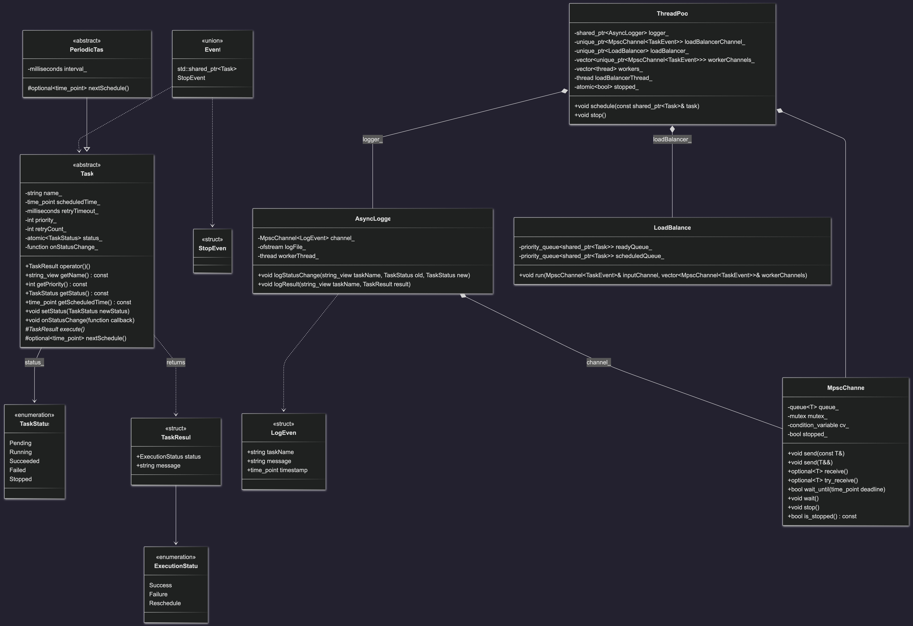

# Opis projektu

Nazwa projektu: Job scheduler

Autor: Maciej Makowski

Link do repozytorium: https://github.com/maciejmakowski2003/Job-Scheduler

# Główne funkcjonalności

- Obsługa zadań jednorazowych oraz cyklicznych 
- Delegowanie zadań do wykonania w określonym czasie i o określonym priorytecie
- Mechanizm ponawiania zadań w przypadku niepowodzenia, z możliwością określenia maksymalnej liczby prób
- Monitorowanie stanu zadań w czasie rzeczywistym
- Asynchroniczne logowanie zmian stanu zadań do pliku

# Diagram klas



# Instrukcja uruchomienia 

```bash
make examples
./build/scheduler-cli [number_of_workers]
```

Przykładowe polecenia w CLI:

- Zaplanuj zadanie do wykonania po 1 sekundzie, które przeanalizuje zawartość pliku test-file.txt z priorytetem 5

```bash
schedule file assets/test-file.txt 5 --delay 1000
```

- Zaplanuj zadanie do wykonania po 2 sekundach, które wykona obliczenia z priorytetem 5

```bash
schedule compute 5 --delay 2000
```

- Zaplanuj zadanie cykliczne ping wykonujące się co 500 milisekund. Nasłuchuj na pingi na porcie 9000 (```nc -u -l <port>```).

```bash
schedule ping 9000 500
```

# Wnioski i potencjalne rozszerzenia

- Lock free SPSC dla komunikacji między `LoadBalancerem` a workerami, co może dodatkowo zwiększyć wydajność.
